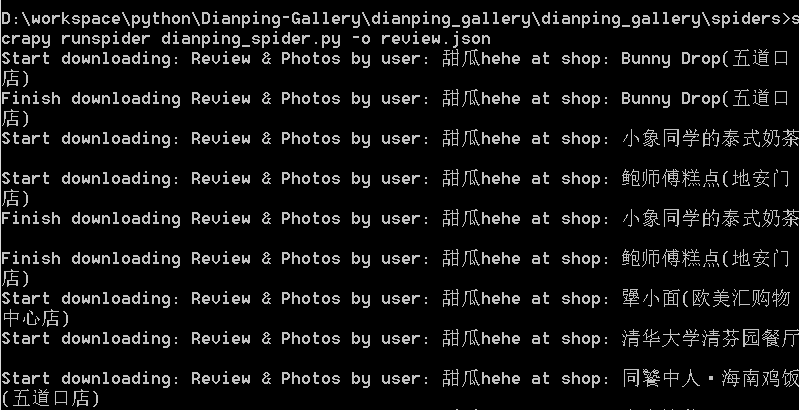

# Dianping-Gallery
Use [Scrapy][scrapy] to crawl text & images from [Dianping.com][dianping] and generate pretty static pages!

## Features

#### 1. Crawling text & images from a specific user's Dianping account and storing them locally
The downloaded images will be stored under `../imgs/`, sorted by `/user/shop/`   
You can also custom images path by change in `IMAGES_STORE` in `settings.py`

![][folders]
![][images]

The text reviews are exported in Json format in `review.json`
![][review]
#### 2. Generating pretty static pages from crawled data to visualize the user's FOOD preference!
To Be Done..

## How to use
#### 1. Dependencies
* Install [Python 3.6][python]
* Install [Scrapy][scrapy] following the [tutorial][scrapy_tutorial]

#### 2. Configurations
* Set `start_urls` in `dianping_spider.py` to the url of the review page that you want to crawl. e.g., click [here][author] to view author's dianping reviews page

#### 3. Run

Under `../Dianping-Gallery/dianping_gallery/dianping_gallery/spiders`, run:   
`scrapy runspider dianping_spider.py -o review.json`  

The downloading process will then be shown in the command screen  
 

[folders]: ./preview/folders.png
[images]: ./preview/images.png
[review]: ./preview/review.PNG
[cmd]: ./preview/cmd.png

[dianping]: http://www.dianping.com/
[author]: http://www.dianping.com/member/44509194/reviews
[python]: https://www.python.org/
[scrapy]: https://scrapy.org/
[scrapy_tutorial]: https://docs.scrapy.org/en/latest/intro/install.html